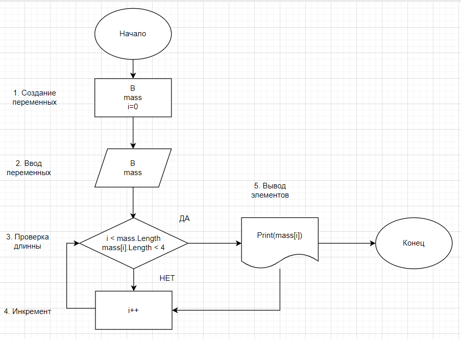

##ОПИСАНИЕ РЕШЕНИЯ ЗАДАЧИ

1. задаём количество элементов массива B
2. создаем массив и вводим B элементов через for
3. через for проходим по каждому элементу массива проверяя соответствие длинны (до 3 символов)
4. через if выводим только те элементы, длинна которых не превышает 3 символа

###Блок-схема решения задачи:
